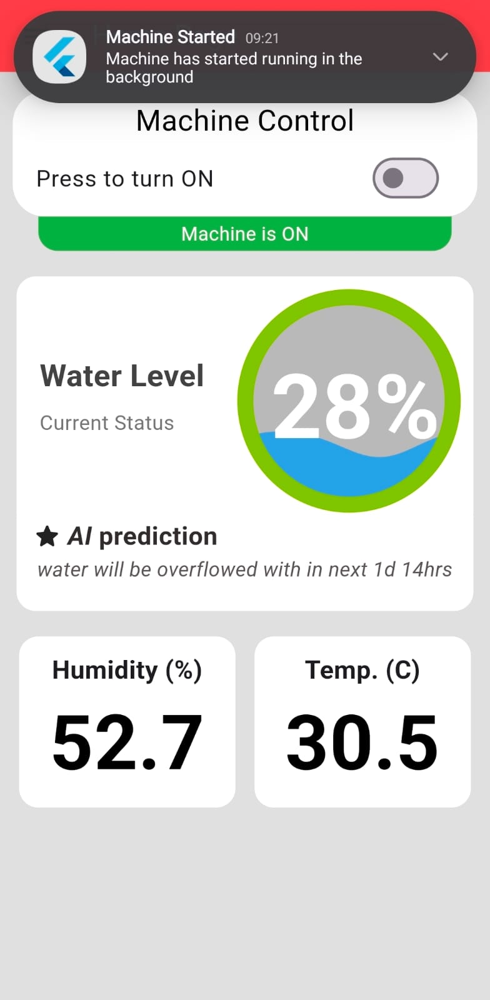
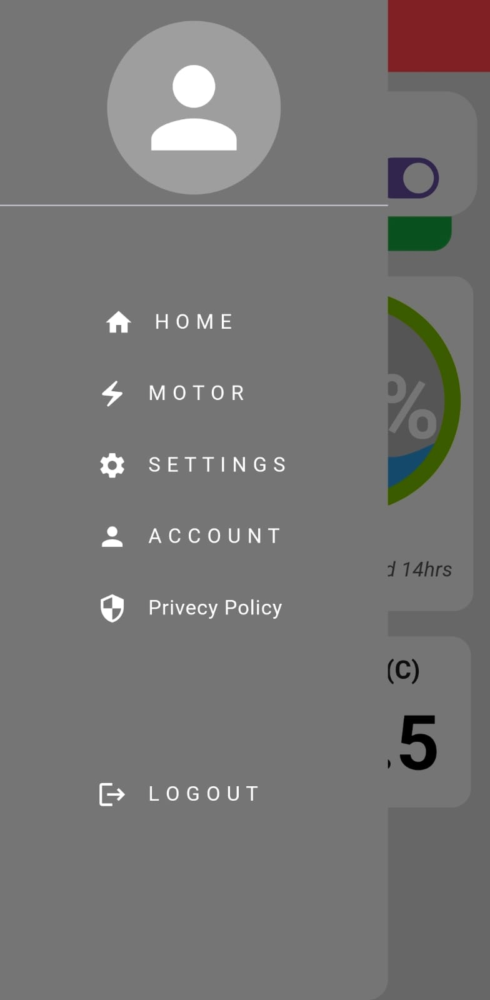
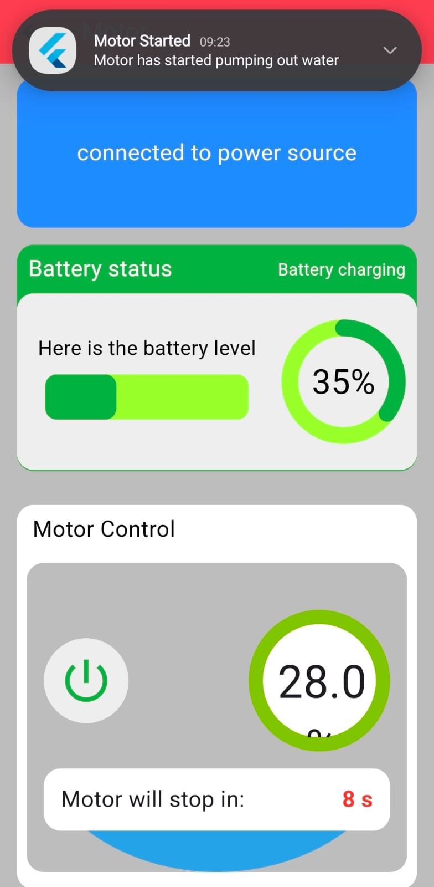
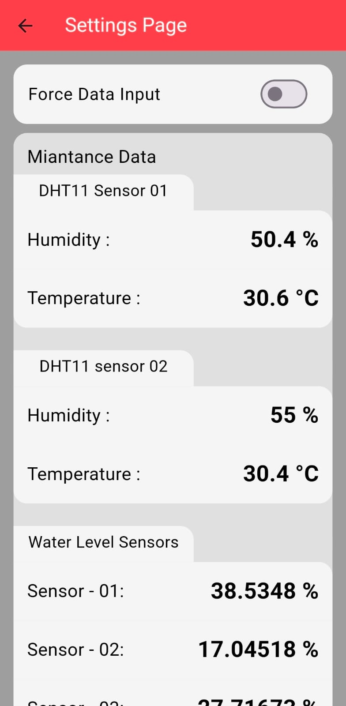

# Smart Water Logging & Drainage System for Single-Door Refrigerators

## Overview

Water logging behind single-door refrigerators is a **common and chronic problem in dense urban areas in India**.  
Stagnant water in these trays often becomes a breeding ground for **mosquito-borne diseases**, especially in warm and humid climates.

This project was built to **automatically monitor and drain accumulated water**, while giving users **real-time visibility and remote control** through a mobile application.

The system consists of **two tightly integrated components**:

- **Embedded hardware system (ESP32-based)**
- **Cross-platform mobile application (Flutter + Firebase)**

This was one of my **first large engineering projects**, developed during my **first year of undergraduate studies**, and took approximately **3 months** to design, build, and integrate.

---

## System Architecture

### 1. Hardware Component

The hardware unit is installed near the refrigerator’s water collection tray and includes:

- **ESP32** as the main microcontroller (Wi-Fi enabled)
- **Analog water level sensor**
- **DC water pump + motor**
- **Two DHT11 sensors** (temperature & humidity)
- **Motor driver circuit**
- **Battery + external power supply**

#### How it works

When powered on, the ESP32:

- Continuously measures **water level**
- Reads **temperature and humidity**

Sensor data is:

- Sent to **Firebase Realtime Database (RTDB)** in real time
- Periodically archived to **Firestore** via **Firebase Cloud Functions**

To reduce sensor noise:

- Readings from the two DHT11 sensors are **averaged**
- A tolerance margin of **±5%** is applied

---

### 2. Mobile Application

The mobile app is built using **Flutter** and connects directly to **Firebase**.

#### User Onboard

- dedicated landing page
- dedicated pages for user learning how to use the app
- in app screensever for first Time user 

#### Authentication

- secure autentication system
- logout feature

#### Home Screen Features

- Live **water level (percentage)**
- Current **temperature & humidity**
- **Real-time updates** from Firebase RTDB

---

## Alerts & Drainage Control

When water level exceeds **75%**:

- The user receives an **in-app notification**

The user can then:

- Clean the tray **manually**  
  **OR**
- **Trigger the motor remotely** from the app

### Motor Control Logic

- The water pump runs on **12V external power**
- The ESP32 and sensors run on **battery power**

When external power is connected:

- The motor control option is **enabled in the app**
- The battery **starts charging**

Motor behavior:

- Runs for **10 seconds per activation**
- Prevents accidental **over-draining**
- Can be **re-triggered manually** if needed

Control flow:

- App updates a value in **Firebase RTDB** (`0 → 1`)
- ESP32 listens for this change
- On detection, ESP32 **activates the motor**

---

## User Modes

The application supports **two user levels**:

### Normal User
- View **live water level**
- View current **temperature & humidity**
- Receive **alerts**

### Advanced User
- View **historical data** (up to **6 months**)
- Access **water level, temperature, and humidity trends**
- Modify or delete **historical records**

This role separation was implemented to explore **basic access control and data governance concepts**.

---

## Data & Backend

### Firebase Realtime Database (RTDB)
- Live sensor data
- Motor control signals

### Firestore
- Long-term historical storage

### Firebase Cloud Functions
- Data aggregation
- Controlled archival from RTDB to Firestore

---

## Tech Stack

### Hardware
- ESP32
- Analog water sensor
- DHT11 sensors
- DC motor & pump
- Motor driver module

### Software
- Flutter (Mobile App)
- Firebase Realtime Database
- Firestore
- Firebase Cloud Functions
- ESP32 Wi-Fi communication

---

